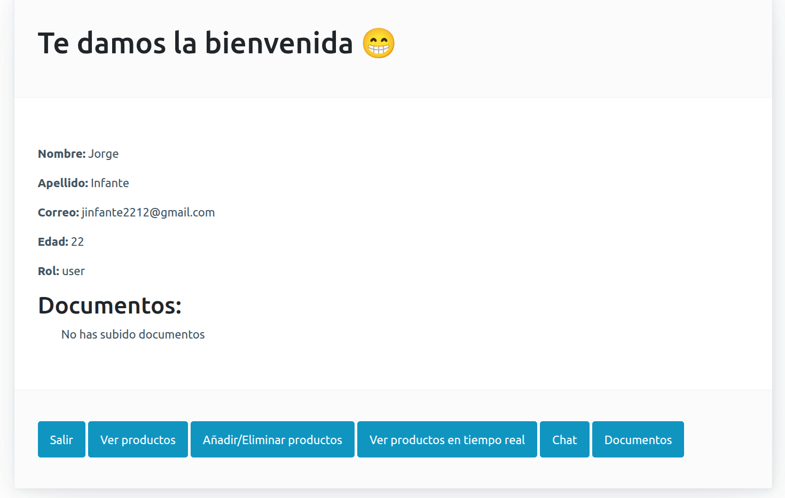
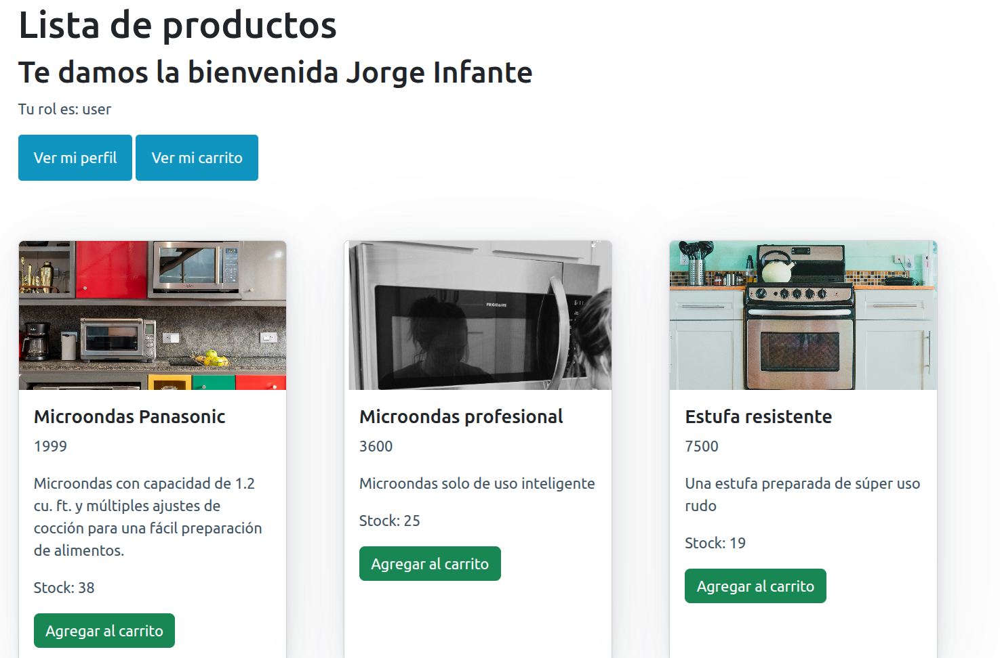
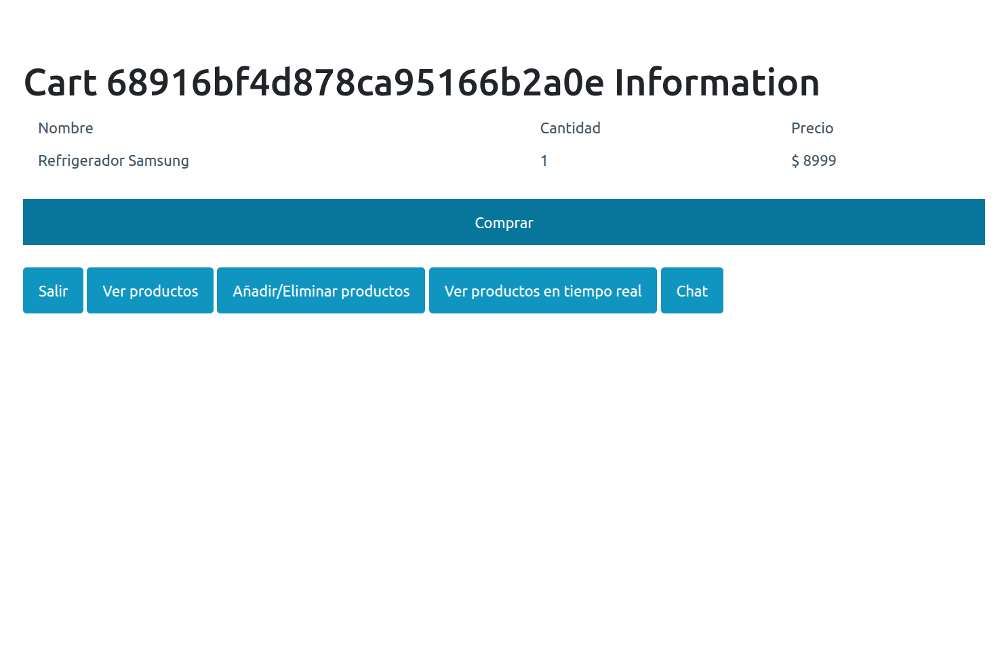
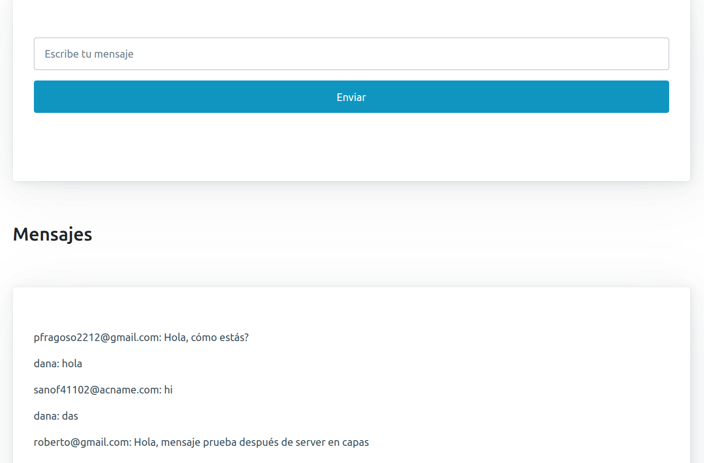
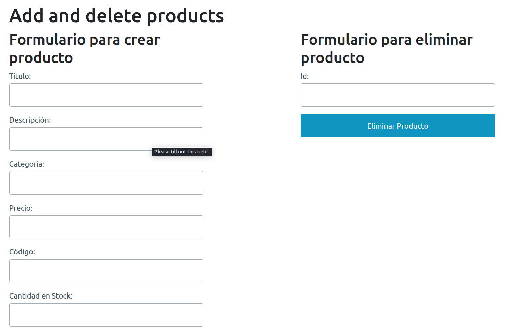

# 🧑‍💻 BackendProject

Este proyecto es un backend completo para un sistema de e-commerce desarrollado con **Node.js**, **Express** y **MongoDB**. Incluye funcionalidades avanzadas como autenticación, manejo de productos, carritos de compra, chat en tiempo real, integración de pagos con Stripe, subida de documentos, y más.

---

## 🚀 Tecnologías y dependencias principales

### Backend
- **Node.js** & **Express**: Framework principal para la creación del servidor.
- **MongoDB** & **Mongoose**: Base de datos NoSQL y ODM para modelar datos.
- **Passport**: Autenticación robusta con estrategias locales, JWT y GitHub.
- **Socket.io**: Comunicación en tiempo real para chat y productos.
- **Stripe**: Procesamiento de pagos seguro.
- **Handlebars**: Motor de plantillas para vistas dinámicas.
- **Swagger**: Documentación interactiva de la API.
- **Winston**: Logger avanzado para monitoreo y depuración.
- **Multer**: Gestión de subida de archivos.
- **Mocha, Chai, Supertest**: Testing unitario y de integración.
- **dotenv**: Gestión de variables de entorno.

---

## 📁 Estructura del proyecto

```
src/
  app.js                # Configuración principal de la app Express
  server.js             # Inicialización del servidor HTTP
  socket.js             # Configuración de Socket.io
  config/               # Configuración general, logger y passport
  controllers/          # Lógica de negocio (users, products, carts, chats, tickets)
  dao/                  # Acceso a datos (MongoDB, modelos)
  db/                   # Conexión a la base de datos
  docs/                 # Documentación Swagger
  dto/                  # Data Transfer Objects
  middlewares/          # Middlewares personalizados (auth, error handler, etc.)
  repositories/         # Abstracción de acceso a datos (repositorios)
  resources/            # Recursos estáticos o utilitarios
  routers/              # Rutas de la API y vistas
  services/             # Servicios de negocio
  utils/                # Utilidades generales (hash, email, paginación, etc.)
  views/                # Vistas Handlebars (login, registro, productos, carrito, chat, etc.)
public/
  css/                  # Estilos
  images/               # Imágenes de productos
  js/                   # Scripts frontend (chat, productos, Stripe, etc.)
  screenshots/          # Capturas de pantalla de las vistas del sistema
tests/
  integrations/         # Pruebas de integración
.env                    # Variables de entorno
package.json            # Dependencias y scripts
```

---

## 🛠️ Funcionalidades principales

### 👤 Autenticación y roles
El sistema utiliza **Passport** para la autenticación, con soporte para:
- **Login local**: Usuarios pueden iniciar sesión con email y contraseña.
- **JWT**: Autenticación basada en tokens para proteger rutas.
- **GitHub**: Login social mediante OAuth.

#### Roles disponibles:
- **Admin**: Acceso completo al sistema, incluyendo gestión de usuarios y productos.
- **Premium**: Usuarios con privilegios adicionales, como la creación de productos.
- **User**: Usuarios estándar con acceso limitado.

#### Funcionalidades por rol:
- **Admin**:
  - Crear, editar y eliminar productos.
  - Gestionar usuarios y roles.
  - Ver todos los carritos.
- **Premium**:
  - Crear productos.
  - Acceder al chat y productos en tiempo real.
- **User**:
  - Ver productos.
  - Añadir productos al carrito.
  - Subir documentos personales.
  - Acceder al chat.

### 🛒 Gestión de productos y carritos
- **Productos**:
  - CRUD completo (crear, leer, actualizar, eliminar).
  - Paginación, búsqueda y filtrado.
  - Subida de imágenes para productos.
- **Carritos**:
  - Añadir productos al carrito.
  - Actualizar cantidades de productos.
  - Eliminar productos del carrito.
  - Generar tickets de compra tras el pago.

### 💬 Chat en tiempo real
- Chat global para todos los usuarios.
- Persistencia de mensajes en MongoDB.
- Actualización en tiempo real mediante **Socket.io**.

### 💳 Pagos y tickets
- Integración con **Stripe** para pagos seguros.
- Generación automática de tickets tras la compra.
- Envío de confirmación por email.

### 📄 Documentación y testing
- Documentación interactiva con **Swagger** disponible en `/api-docs`.
- Pruebas unitarias y de integración con **Mocha**, **Chai** y **Supertest**.
- Mocking de datos con **Faker**.

### 📝 Subida de documentos
- Los usuarios pueden subir documentos personales (identificación, comprobante de domicilio, estado de cuenta).
- Promoción automática a "premium" si suben todos los documentos requeridos.

---

## 🌐 Frontend con Handlebars

El proyecto incluye un frontend básico desarrollado con **Handlebars** para las vistas dinámicas. Las vistas están integradas directamente en el backend y se encuentran en la carpeta [`src/views`](src/views). La lógica de las vistas está separada y gestionada mediante endpoints específicos en los routers.

### Vistas principales:

1. **📄 Perfil del usuario** (`/views/profile`)  
   Muestra información del usuario, incluyendo sus documentos y rol.  
   

2. **🛍️ Productos** (`/views/products`)  
   Lista de productos con opciones de búsqueda y filtrado.  
   

3. **🛒 Carrito** (`/views/idcarts`)  
   Vista del carrito de compras con los productos añadidos.  
   

4. **💬 Chat** (`/views/chat`)  
   Chat en tiempo real para comunicación entre usuarios.  
   

5. **🛠️ Vista de administrador** (`/views/admin`)  
   Panel para añadir y eliminar productos.  
   

## 📄 Entidades principales

### Usuario
```json
{
  "first_name": "John",
  "last_name": "Doe",
  "email": "john.doe@example.com",
  "password": "hashed_password",
  "role": "user",
  "cartId": "ObjectId",
  "documents": [
    { "name": "identification", "reference": "/path/to/file" }
  ],
  "last_connection": "2025-08-04T12:00:00Z"
}
```

### Producto
```json
{
  "title": "Producto 1",
  "description": "Descripción del producto",
  "price": 100,
  "photos": [{ "name": "photo1", "reference": "/path/to/photo" }],
  "code": "ABC123",
  "stock": 50,
  "category": "Categoría",
  "owner": "ObjectId"
}
```

### Carrito
```json
{
  "products": [
    { "product": "ObjectId", "quantity": 2 }
  ]
}
```

### Ticket
```json
{
  "code": "TICKET123",
  "purchase_datetime": "2025-08-04T12:00:00Z",
  "amount": 200,
  "purchaser": "john.doe@example.com"
}
```

---

## 🔗 Endpoints destacados

### Autenticación
- **POST** `/api/sessions/login`: Inicia sesión y genera un JWT.
- **POST** `/api/sessions/register`: Registra un nuevo usuario.
- **GET** `/api/sessions/github`: Inicia sesión con GitHub.

### Productos
- **GET** `/api/products`: Lista de productos con paginación.
- **POST** `/api/products`: Crear un nuevo producto (solo admin/premium).
- **PUT** `/api/products/:productId`: Actualizar un producto (solo admin/premium).
- **DELETE** `/api/products/:productId`: Eliminar un producto (solo admin).

### Carritos
- **POST** `/api/carts`: Crear un carrito vacío.
- **POST** `/api/carts/:cartId/products/:productId`: Añadir producto al carrito.
- **DELETE** `/api/carts/:cartId/products/:productId`: Eliminar producto del carrito.
- **POST** `/api/carts/:cartId/purchase`: Generar ticket tras el pago.

### Usuarios
- **PATCH** `/api/users/premium/:uid`: Cambiar rol de usuario a premium.
- **POST** `/api/users/:uid/documents`: Subir documentos personales.


---

## 📄 Documentación de la API

La documentación interactiva está disponible en [http://localhost:8080/api-docs](http://localhost:8080/api-docs).

---

## 📝 Convención de commits

Se utiliza la convención [Conventional Commits](https://www.conventionalcommits.org/).

---

## 👨‍💻 Autor

Desarrollado por Jorge Infante Fragoso

Estudiante de Ingeniería en Computación

Universidad Autónoma Metropolitana – Unidad Cuajimalpa

📬 Contacto
Para dudas, sugerencias o colaboración, escribe a:

jinfante2212@gmail.com

---

## 📬 Contribuciones

¡Las contribuciones son bienvenidas! Por favor, abre un issue o pull request.

---

## 📝 Licencia

MIT
